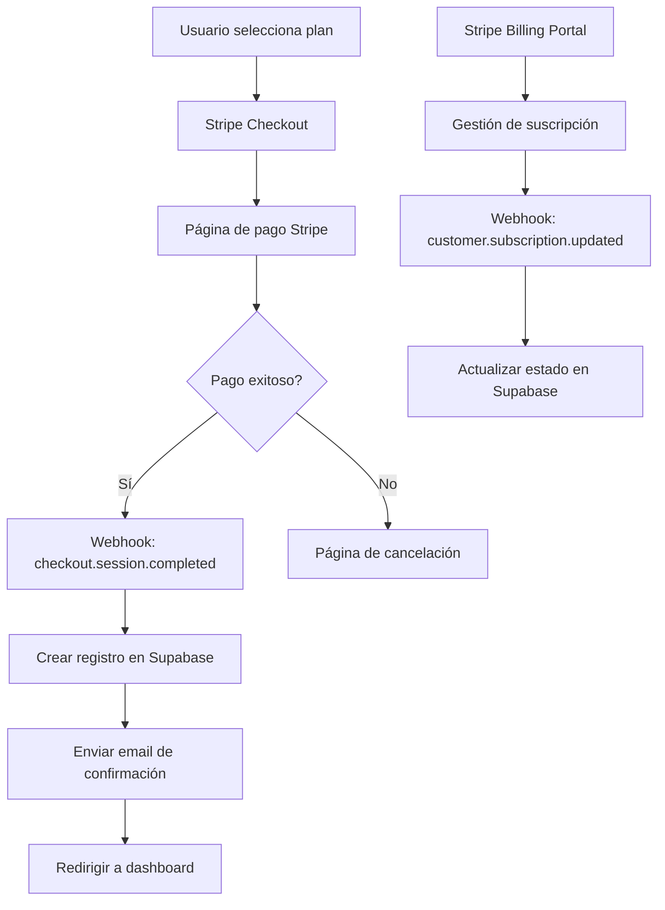
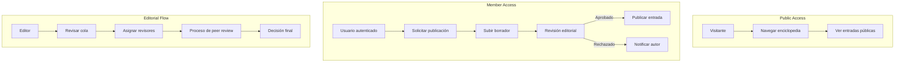
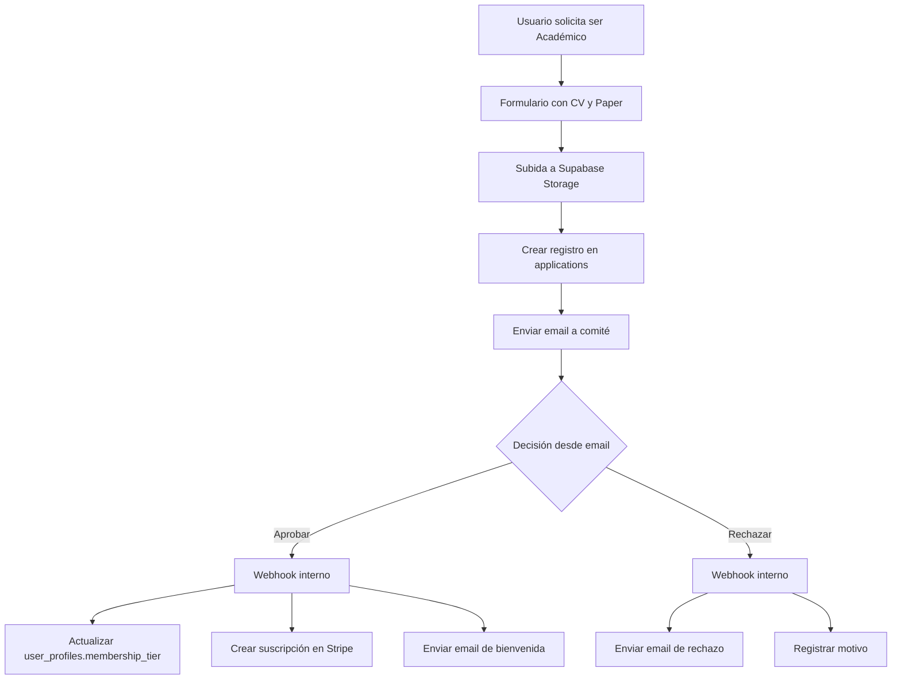
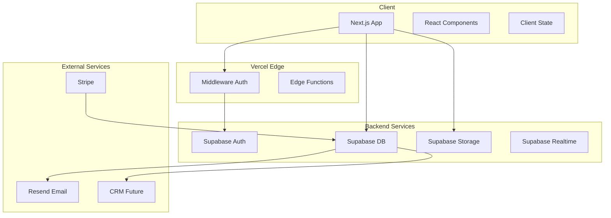

# Auditoría Técnica y Funcional - Escuela Hispánica

**Fecha:** 13 de Febrero de 2026  
**Versión:** 1.0  
**Autor:** Arquitecto de Software Senior

---

## Índice

1. [Resumen Ejecutivo](#1-resumen-ejecutivo)
2. [Estado Actual del Proyecto](#2-estado-actual-del-proyecto)
3. [Análisis del Stack Tecnológico](#3-análisis-del-stack-tecnológico)
4. [Diagnóstico de Componentes Críticos](#4-diagnóstico-de-componentes-críticos)
5. [Trabajos Necesarios para Integraciones](#5-trabajos-necesarios-para-integraciones)
6. [Arquitectura Propuesta](#6-arquitectura-propuesta)
7. [Roadmap de Desarrollo](#7-roadmap-de-desarrollo)
8. [Visión 360° y Recomendaciones Críticas](#8-visión-360-y-recomendaciones-críticas)
9. [Oportunidades de Mejora](#9-oportunidades-de-mejora)
10. [Anexos](#10-anexos)

---

## 1. Resumen Ejecutivo

### Situación Actual

El proyecto **Escuela Hispánica** es una landing page desarrollada con Next.js 16.1.6 y React 19, que se encuentra en un estado **proto-MVP**. El código base está bien estructurado pero carece de las capas de backend, autenticación y gestión de usuarios necesarias para convertirse en un producto digital funcional.

### Hallazgos Principales

| Aspecto | Estado | Criticidad |
|---------|--------|------------|
| Frontend/UI | ✅ Funcional | Baja |
| Arquitectura de componentes | ✅ Bien estructurada | Baja |
| Sistema de tipos | ⚠️ Incompleto | Media |
| Capa de datos | ❌ Solo mock data | Alta |
| Autenticación | ❌ No implementada | Crítica |
| Pasarela de pagos | ❌ No implementada | Crítica |
| Gestión de usuarios | ❌ No implementada | Crítica |
| Preparación para Vercel | ⚠️ Parcial | Media |
| Preparación para Supabase | ⚠️ Placeholder | Alta |

### Recomendación Principal

El proyecto requiere una **reestructuración arquitectónica significativa** antes de implementar las funcionalidades de negocio. La inversión en una base sólida permitirá la escalabilidad hacia el macro-proyecto de centralización de la fundación.

---

## 2. Estado Actual del Proyecto

### 2.1 Estructura de Directorios

```
escuela-hispánica-landing-page/
├── src/
│   ├── app/                    # App Router (Next.js 16)
│   │   ├── page.tsx           # Home
│   │   ├── layout.tsx         # Layout principal
│   │   ├── globals.css        # Estilos globales
│   │   ├── actividades/       # Páginas de actividades
│   │   ├── colabora/          # Página de membresías
│   │   ├── contacto/          # Formulario de contacto
│   │   ├── la-escuela/        # Información institucional
│   │   ├── proyectos/         # Proyectos (1776)
│   │   ├── publicaciones/     # Artículos
│   │   └── recursos/          # Recursos bibliográficos
│   ├── components/
│   │   ├── home/              # Componentes del home
│   │   ├── sections/          # Navbar, Footer, Hero
│   │   ├── ui/                # UI components
│   │   └── features/          # Features (vacío)
│   ├── lib/
│   │   ├── mock-data/         # Datos de prueba
│   │   └── supabase/          # Cliente placeholder
│   └── types/
│       └── index.ts           # Definiciones de tipos
├── public/
│   └── images/                # Assets estáticos
├── middleware.ts              # Middleware auth (placeholder)
├── next.config.ts             # Configuración Next.js
├── package.json
└── tsconfig.json
```

### 2.2 Análisis de Dependencias

```json
{
  "dependencies": {
    "next": "16.1.6",           // ✅ Última versión estable
    "react": "19.2.3",          // ✅ React 19 con mejoras
    "react-dom": "19.2.3",
    "lucide-react": "^0.562.0", // ✅ Iconos
    "@tailwindcss/typography": "^0.5.19"
  },
  "devDependencies": {
    "typescript": "^5",         // ✅ TypeScript 5
    "tailwindcss": "^4",        // ✅ Tailwind 4
    "eslint": "^9",             // ✅ ESLint 9
    "babel-plugin-react-compiler": "1.0.0" // ✅ React Compiler
  }
}
```

**⚠️ Dependencias Faltantes Críticas:**

```json
{
  "required": {
    "@supabase/supabase-js": "Para backend y autenticación",
    "@supabase/ssr": "Para autenticación SSR con Next.js",
    "stripe": "Para pasarela de pagos",
    "zod": "Para validación de esquemas",
    "react-hook-form": "Para formularios robustos",
    "@hookform/resolvers": "Integración zod con react-hook-form",
    "resend": "Para emails transaccionales",
    "nuqs": "Para estado de URL persistente"
  }
}
```

### 2.3 Sistema de Tipos Actual

El archivo [`src/types/index.ts`](src/types/index.ts) define las interfaces básicas:

```typescript
// Tipos existentes
interface Article { ... }      // ✅ Básico
interface Activity { ... }     // ✅ Básico
interface Author { ... }       // ✅ Básico
interface Project { ... }      // ✅ Básico
interface MemberPlan { ... }   // ⚠️ Incompleto
interface BiblioItem { ... }   // ✅ Básico
interface MultimediaItem { ... } // ✅ Básico
```

**❌ Tipos Faltantes:**

```typescript
// Necesarios para el sistema completo
interface User { ... }           // Usuario autenticado
interface Membership { ... }     // Membresía activa
interface Subscription { ... }   // Suscripción Stripe
interface Application { ... }    // Solicitud académica
interface EncyclopediaEntry { ... } // Entrada de enciclopedia
interface Lead { ... }           // Lead capturado
interface Notification { ... }   // Notificaciones
interface AuditLog { ... }       // Registro de auditoría
```

---

## 3. Análisis del Stack Tecnológico

### 3.1 Frontend - Estado Actual

| Tecnología | Versión | Evaluación |
|------------|---------|------------|
| Next.js | 16.1.6 | ✅ Óptimo - App Router estable |
| React | 19.2.3 | ✅ Óptimo - Con React Compiler |
| TypeScript | 5.x | ✅ Óptimo |
| Tailwind CSS | 4.x | ✅ Óptimo |
| ESLint | 9.x | ✅ Óptimo |

### 3.2 Backend - Estado Actual

| Componente | Estado | Acción Requerida |
|------------|--------|------------------|
| Base de datos | ❌ No configurada | Configurar Supabase |
| Autenticación | ❌ No implementada | Implementar Supabase Auth |
| API Routes | ⚠️ Parcial | Crear endpoints REST |
| Storage | ❌ No configurado | Configurar Supabase Storage |

### 3.3 Infraestructura - Estado Actual

| Componente | Estado | Acción Requerida |
|------------|--------|------------------|
| Vercel | ⚠️ Preparado parcialmente | Configurar variables de entorno |
| Supabase | ❌ Placeholder | Crear proyecto y esquemas |
| Stripe | ❌ No configurado | Crear cuenta y productos |
| Email | ❌ No configurado | Configurar Resend/SendGrid |

---

## 4. Diagnóstico de Componentes Críticos

### 4.1 Sistema de Membresías

**Ubicación:** [`src/lib/mock-data/memberships.ts`](src/lib/mock-data/memberships.ts)

**Estado Actual:**
```typescript
// Datos estáticos sin persistencia
export const membershipPlans: MemberPlan[] = [
  { id: 'amigo', price: 10, interval: 'monthly', ... },
  { id: 'academico', price: 100, interval: 'annual', ... },
  { id: 'mecenas', price: 1000, interval: 'annual', ... }
];
```

**Problemas Identificados:**

1. **Sin persistencia:** Los datos no se guardan en base de datos
2. **Sin vinculación a usuarios:** No hay relación usuario-membresía
3. **Sin estados de suscripción:** No hay tracking de pagos
4. **Sin flujo de aprobación:** El proceso académico es manual

**Trabajo Requerido:**

- [ ] Diseñar esquema de base de datos para membresías
- [ ] Implementar modelos de suscripción en Stripe
- [ ] Crear webhooks para sincronización de estados
- [ ] Implementar flujo de aprobación académica

### 4.2 Formulario de Contacto

**Ubicación:** [`src/app/contacto/page.tsx`](src/app/contacto/page.tsx)

**Estado Actual:**
```tsx
<form className="space-y-6">
  <input type="text" ... />
  <input type="email" ... />
  <select>...</select>
  <textarea ... />
  <button type="submit">ENVIAR MENSAJE</button>
</form>
```

**Problemas Identificados:**

1. **Sin validación:** No hay validación client-side ni server-side
2. **Sin envío:** El formulario no tiene acción
3. **Sin feedback:** No hay confirmación de envío
4. **Sin persistencia:** Los mensajes no se guardan

**Trabajo Requerido:**

- [ ] Implementar validación con Zod
- [ ] Crear API Route para procesamiento
- [ ] Integrar con servicio de email
- [ ] Implementar feedback visual

### 4.3 Middleware de Autenticación

**Ubicación:** [`middleware.ts`](middleware.ts)

**Estado Actual:**
```typescript
export function middleware(request: NextRequest) {
  // TODO: Phase 2 - Add Supabase Auth session check
  return NextResponse.next();
}

export const config = {
  matcher: ['/miembros/:path*', '/admin/:path*'],
};
```

**Problemas Identificados:**

1. **Sin implementación:** Solo passthrough
2. **Sin verificación de sesión:** No valida tokens
3. **Sin roles:** No hay control de acceso por rol

**Trabajo Requerido:**

- [ ] Implementar verificación de sesión Supabase
- [ ] Crear sistema de roles (admin, academico, amigo, mecenas)
- [ ] Implementar redirecciones según estado de autenticación

### 4.4 Cliente Supabase

**Ubicación:** [`src/lib/supabase/client.ts`](src/lib/supabase/client.ts)

**Estado Actual:**
```typescript
// Placeholder client - will be null until Supabase is configured
export const supabase = null;

export function isSupabaseConfigured(): boolean {
  return supabase !== null;
}
```

**Problemas Identificados:**

1. **Sin cliente real:** Solo placeholder
2. **Sin tipos de base de datos:** Database type vacío
3. **Sin servidor cliente:** Falta cliente para SSR

**Trabajo Requerido:**

- [ ] Instalar @supabase/supabase-js y @supabase/ssr
- [ ] Crear cliente para navegador
- [ ] Crear cliente para servidor
- [ ] Generar tipos desde esquema de base de datos

---

## 5. Trabajos Necesarios para Integraciones

### 5.1 Integración con Stripe

#### Arquitectura Propuesta



#### Componentes a Desarrollar

| Componente | Descripción | Prioridad |
|------------|-------------|-----------|
| API Route: checkout | Crear sesión de pago | Crítica |
| API Route: webhook | Recibir eventos de Stripe | Crítica |
| API Route: billing-portal | Portal de gestión | Alta |
| Página: success | Confirmación de pago | Alta |
| Página: cancel | Cancelación de pago | Alta |
| Componente: PricingTable | Tabla de precios interactiva | Media |
| Utilidad: stripe-client | Cliente Stripe server-side | Crítica |

#### Esquema de Base de Datos

```sql
-- Tabla de suscripciones
CREATE TABLE subscriptions (
  id UUID PRIMARY KEY DEFAULT gen_random_uuid(),
  user_id UUID REFERENCES auth.users(id) NOT NULL,
  stripe_subscription_id TEXT UNIQUE NOT NULL,
  stripe_customer_id TEXT NOT NULL,
  stripe_price_id TEXT NOT NULL,
  status TEXT NOT NULL DEFAULT 'active',
  current_period_start TIMESTAMPTZ,
  current_period_end TIMESTAMPTZ,
  cancel_at_period_end BOOLEAN DEFAULT FALSE,
  created_at TIMESTAMPTZ DEFAULT NOW(),
  updated_at TIMESTAMPTZ DEFAULT NOW()
);

-- Tabla de eventos de Stripe
CREATE TABLE stripe_events (
  id UUID PRIMARY KEY DEFAULT gen_random_uuid(),
  stripe_event_id TEXT UNIQUE NOT NULL,
  type TEXT NOT NULL,
  data JSONB NOT NULL,
  processed BOOLEAN DEFAULT FALSE,
  created_at TIMESTAMPTZ DEFAULT NOW()
);
```

### 5.2 Integración con CRM

#### Arquitectura de Datos para CRM-Agnóstico

```mermaid
flowchart LR
  subgraph Supabase
    A[users] --> B[user_profiles]
    A --> C[subscriptions]
    A --> D[activities]
    A --> E[encyclopedia_contributions]
  end
  
  subgraph Integration Layer
    F[webhooks/outgoing]
    G[crm_sync_queue]
  end
  
  subgraph CRM Options
    H[HubSpot]
    I[Open Source CRM]
    J[Custom Solution]
  end
  
  Supabase --> Integration Layer
  Integration Layer --> CRM Options
```

#### Esquema de Base de Datos para CRM

```sql
-- Perfil de usuario extendido
CREATE TABLE user_profiles (
  id UUID PRIMARY KEY DEFAULT gen_random_uuid(),
  user_id UUID REFERENCES auth.users(id) UNIQUE NOT NULL,
  full_name TEXT,
  avatar_url TEXT,
  phone TEXT,
  country TEXT,
  city TEXT,
  institution TEXT,
  bio TEXT,
  academic_credentials JSONB,
  membership_tier TEXT DEFAULT 'amigo',
  membership_status TEXT DEFAULT 'inactive',
  crm_contact_id TEXT, -- ID en el CRM externo
  crm_synced_at TIMESTAMPTZ,
  created_at TIMESTAMPTZ DEFAULT NOW(),
  updated_at TIMESTAMPTZ DEFAULT NOW()
);

-- Cola de sincronización CRM
CREATE TABLE crm_sync_queue (
  id UUID PRIMARY KEY DEFAULT gen_random_uuid(),
  entity_type TEXT NOT NULL, -- 'user', 'subscription', 'activity'
  entity_id UUID NOT NULL,
  action TEXT NOT NULL, -- 'create', 'update', 'delete'
  payload JSONB NOT NULL,
  status TEXT DEFAULT 'pending',
  attempts INT DEFAULT 0,
  last_error TEXT,
  created_at TIMESTAMPTZ DEFAULT NOW(),
  processed_at TIMESTAMPTZ
);

-- Leads capturados
CREATE TABLE leads (
  id UUID PRIMARY KEY DEFAULT gen_random_uuid(),
  email TEXT NOT NULL,
  name TEXT,
  source TEXT NOT NULL, -- 'contact_form', 'activity_registration', etc.
  activity_id UUID REFERENCES activities(id),
  metadata JSONB,
  crm_lead_id TEXT,
  created_at TIMESTAMPTZ DEFAULT NOW()
);
```

### 5.3 Repositorio Académico - Enciclopedia

#### Arquitectura Propuesta



#### Esquema de Base de Datos

```sql
-- Entradas de la enciclopedia
CREATE TABLE encyclopedia_entries (
  id UUID PRIMARY KEY DEFAULT gen_random_uuid(),
  slug TEXT UNIQUE NOT NULL,
  title TEXT NOT NULL,
  abstract TEXT NOT NULL,
  content JSONB NOT NULL,
  author_id UUID REFERENCES auth.users(id) NOT NULL,
  status TEXT DEFAULT 'draft', -- draft, pending_review, published, archived
  reviewer_id UUID REFERENCES auth.users(id),
  published_at TIMESTAMPTZ,
  tags TEXT[],
  category TEXT,
  metadata JSONB,
  created_at TIMESTAMPTZ DEFAULT NOW(),
  updated_at TIMESTAMPTZ DEFAULT NOW()
);

-- Versiones/historial
CREATE TABLE encyclopedia_versions (
  id UUID PRIMARY KEY DEFAULT gen_random_uuid(),
  entry_id UUID REFERENCES encyclopedia_entries(id) NOT NULL,
  version INT NOT NULL,
  content JSONB NOT NULL,
  changed_by UUID REFERENCES auth.users(id),
  change_summary TEXT,
  created_at TIMESTAMPTZ DEFAULT NOW(),
  UNIQUE(entry_id, version)
);

-- Contribuciones de usuarios
CREATE TABLE user_contributions (
  id UUID PRIMARY KEY DEFAULT gen_random_uuid(),
  user_id UUID REFERENCES auth.users(id) NOT NULL,
  entry_id UUID REFERENCES encyclopedia_entries(id),
  contribution_type TEXT NOT NULL, -- 'author', 'reviewer', 'editor'
  created_at TIMESTAMPTZ DEFAULT NOW()
);
```

### 5.4 Flujo de Admisión Académica

#### Arquitectura del Proceso



#### Esquema de Base de Datos

```sql
-- Solicitudes académicas
CREATE TABLE academic_applications (
  id UUID PRIMARY KEY DEFAULT gen_random_uuid(),
  user_id UUID REFERENCES auth.users(id) NOT NULL,
  status TEXT DEFAULT 'pending', -- pending, approved, rejected
  cv_url TEXT NOT NULL,
  paper_url TEXT NOT NULL,
  motivation_text TEXT,
  reviewed_by UUID REFERENCES auth.users(id),
  reviewed_at TIMESTAMPTZ,
  rejection_reason TEXT,
  metadata JSONB,
  created_at TIMESTAMPTZ DEFAULT NOW(),
  updated_at TIMESTAMPTZ DEFAULT NOW()
);

-- Tokens para acciones por email
CREATE TABLE email_action_tokens (
  id UUID PRIMARY KEY DEFAULT gen_random_uuid(),
  application_id UUID REFERENCES academic_applications(id) NOT NULL,
  action TEXT NOT NULL, -- 'approve', 'reject'
  token TEXT UNIQUE NOT NULL,
  expires_at TIMESTAMPTZ NOT NULL,
  used_at TIMESTAMPTZ,
  created_at TIMESTAMPTZ DEFAULT NOW()
);
```

---

## 6. Arquitectura Propuesta

### 6.1 Visión General del Sistema



### 6.2 Estructura de Directorios Propuesta

```
src/
├── app/
│   ├── (auth)/                 # Grupo de rutas auth
│   │   ├── login/
│   │   ├── register/
│   │   ├── forgot-password/
│   │   └── callback/
│   ├── (dashboard)/            # Grupo de rutas protegidas
│   │   ├── miembro/
│   │   │   ├── perfil/
│   │   │   ├── suscripcion/
│   │   │   └── contribuciones/
│   │   └── admin/
│   │       ├── aplicaciones/
│   │       ├── usuarios/
│   │       └── contenido/
│   ├── (public)/               # Rutas públicas
│   │   ├── page.tsx
│   │   ├── actividades/
│   │   ├── publicaciones/
│   │   ├── enciclopedia/
│   │   └── colabora/
│   ├── api/
│   │   ├── auth/
│   │   ├── checkout/
│   │   ├── webhooks/
│   │   │   ├── stripe/
│   │   │   └── email-actions/
│   │   └── contact/
│   └── layout.tsx
├── components/
│   ├── ui/                     # Componentes base
│   ├── forms/                  # Formularios
│   ├── features/               # Features específicas
│   └── layouts/                # Layouts
├── lib/
│   ├── supabase/
│   │   ├── client.ts
│   │   ├── server.ts
│   │   └── admin.ts
│   ├── stripe/
│   │   ├── client.ts
│   │   └── config.ts
│   ├── email/
│   │   └── resend.ts
│   └── validations/
│       └── schemas.ts
├── hooks/
│   ├── use-auth.ts
│   ├── use-subscription.ts
│   └── use-user.ts
└── types/
    ├── database.ts             # Tipos generados de Supabase
    └── index.ts
```

### 6.3 Configuración de Vercel

```json
// vercel.json
{
  "framework": "nextjs",
  "regions": ["mad1"],
  "env": {
    "NEXT_PUBLIC_SUPABASE_URL": "@supabase-url",
    "NEXT_PUBLIC_SUPABASE_ANON_KEY": "@supabase-anon-key",
    "SUPABASE_SERVICE_ROLE_KEY": "@supabase-service-key",
    "STRIPE_SECRET_KEY": "@stripe-secret",
    "STRIPE_WEBHOOK_SECRET": "@stripe-webhook",
    "RESEND_API_KEY": "@resend-key"
  },
  "functions": {
    "src/app/api/webhooks/**": {
      "memory": 1024
    }
  }
}
```

---

## 7. Roadmap de Desarrollo

### Fase 1: Fundamentos - Semanas 1-4

| Semana | Tareas | Entregables |
|--------|--------|-------------|
| 1 | Configuración Supabase | Proyecto creado, esquemas base |
| 2 | Autenticación | Login, registro, recuperación |
| 3 | Perfil de usuario | Dashboard básico, perfil editable |
| 4 | Infraestructura | CI/CD, variables de entorno, tests |

**Dependencias:**
- Crear proyecto en Supabase
- Configurar dominio en Vercel
- Crear cuenta Stripe (modo test)

### Fase 2: Monetización - Semanas 5-8

| Semana | Tareas | Entregables |
|--------|--------|-------------|
| 5 | Productos Stripe | 3 planes configurados |
| 6 | Checkout flow | Página de pago funcional |
| 7 | Webhooks | Sincronización de estados |
| 8 | Billing portal | Gestión de suscripciones |

**Dependencias:**
- Fase 1 completada
- Cuenta Stripe verificada

### Fase 3: Contenido y Leads - Semanas 9-12

| Semana | Tareas | Entregables |
|--------|--------|-------------|
| 9 | Formularios con validación | Contacto funcional |
| 10 | Captura de leads | Formularios en actividades |
| 11 | Email transaccional | Confirmaciones, notificaciones |
| 12 | Panel de administración | Gestión de leads |

**Dependencias:**
- Cuenta Resend/SendGrid
- Plantillas de email

### Fase 4: Enciclopedia y Académicos - Semanas 13-18

| Semana | Tareas | Entregables |
|--------|--------|-------------|
| 13 | Esquema enciclopedia | Base de datos lista |
| 14 | CRUD entradas | Editor de contenido |
| 15 | Flujo de revisión | Cola de aprobación |
| 16 | Aplicación académica | Formulario con archivos |
| 17 | Flujo de aprobación email | Tokens, webhooks |
| 18 | Integración completa | Sistema funcional |

### Fase 5: CRM y Optimización - Semanas 19-22

| Semana | Tareas | Entregables |
|--------|--------|-------------|
| 19 | Capa de abstracción CRM | Interfaces genéricas |
| 20 | Sincronización | Cola de exportación |
| 21 | Optimización | Performance, SEO |
| 22 | Documentación | Guías de uso |

---

## 8. Visión 360° y Recomendaciones Críticas

### 8.1 Análisis Crítico del Enfoque Actual

#### Fortalezas

1. **Base tecnológica sólida:** Next.js 16 + React 19 + TypeScript es una combinación moderna y mantenible
2. **Diseño consistente:** El sistema de diseño "Dark Academia" está bien implementado
3. **Estructura modular:** Los componentes están bien organizados
4. **Preparación para React Compiler:** Ya configurado

#### Debilidades Críticas

1. **Falta de estrategia de migración de datos:** Los datos mock están hardcodeados sin ruta clara a persistencia
2. **Ausencia de validación:** Sin validación server-side, el sistema es vulnerable
3. **Sin tests:** No hay tests unitarios, de integración ni E2E
4. **Documentación insuficiente:** El README es genérico y no refleja el proyecto real

### 8.2 Riesgos Identificados

| Riesgo | Probabilidad | Impacto | Mitigación |
|--------|--------------|---------|------------|
| Scope creep en enciclopedia | Alta | Alto | MVP con features limitadas |
| Complejidad de flujo académico | Media | Alto | Simplificar proceso inicial |
| Integración CRM postergada | Alta | Medio | Diseñar desde día 1 |
| Dependencia de servicios externos | Media | Alto | Implementar fallbacks |
| Migración de datos existentes | Baja | Alto | Plan de migración explícito |

### 8.3 Recomendaciones Arquitectónicas

#### 1. Primero la Base de Datos

**Problema:** El desarrollo frontend-first sin esquema de BD definido crea inconsistencias.

**Recomendación:**
```
Orden correcto:
1. Diseñar esquema completo en Supabase
2. Generar tipos TypeScript desde el esquema
3. Adaptar componentes a los tipos generados
4. Eliminar mock data progresivamente
```

#### 2. Autenticación desde el Inicio

**Problema:** Muchas features dependen de autenticación pero se planifican en paralelo.

**Recomendación:**
```
Implementar autenticación completa antes de:
- Sistema de membresías
- Dashboard de usuario
- Enciclopedia con permisos
- Cualquier funcionalidad de pago
```

#### 3. Diseño para Multi-Tenant Futuro

**Problema:** El macro-proyecto requiere centralización pero el diseño actual es single-tenant.

**Recomendación:**
```sql
-- Considerar desde ahora
CREATE TABLE organizations (
  id UUID PRIMARY KEY,
  slug TEXT UNIQUE,
  name TEXT,
  config JSONB
);

CREATE TABLE user_organizations (
  user_id UUID REFERENCES auth.users(id),
  organization_id UUID REFERENCES organizations(id),
  role TEXT,
  PRIMARY KEY (user_id, organization_id)
);
```

#### 4. API Versioning

**Problema:** Sin versionado de API, cambios futuros romperán integraciones.

**Recomendación:**
```
/api/v1/checkout
/api/v1/webhooks/stripe
/api/v1/contact
```

### 8.4 Deuda Técnica Actual

| Ítem | Esfuerzo | Prioridad |
|------|----------|-----------|
| Eliminar mock data | Medio | Alta |
| Implementar validación | Medio | Crítica |
| Añadir tests | Alto | Alta |
| Documentar API | Medio | Media |
| Refactorizar tipos | Bajo | Media |
| Configurar ESLint estricto | Bajo | Baja |

---

## 9. Oportunidades de Mejora

### 9.1 Herramientas Recomendadas

#### Desarrollo

| Herramienta | Propósito | Justificación |
|-------------|-----------|---------------|
| **Zod** | Validación | Type-safe, integración con React Hook Form |
| **React Hook Form** | Formularios | Performance, validación integrada |
| **TanStack Query** | Estado servidor | Cache, sincronización, optimismo |
| **nuqs** | Estado URL | Filtros, paginación persistente |

#### Testing

| Herramienta | Propósito | Justificación |
|-------------|-----------|---------------|
| **Vitest** | Tests unitarios | Rápido, compatible con Vite |
| **Playwright** | Tests E2E | Multi-navegador, paralelizable |
| **MSW** | Mock API | Tests aislados, desarrollo offline |

#### Calidad

| Herramienta | Propósito | Justificación |
|-------------|-----------|---------------|
| **Husky** | Git hooks | Pre-commit checks |
| **lint-staged** | Lint incremental | Solo archivos modificados |
| **Changesets** | Versionado | Changelog automático |

#### Monitoreo

| Herramienta | Propósito | Justificación |
|-------------|-----------|---------------|
| **Sentry** | Error tracking | Alertas, stack traces |
| **Vercel Analytics** | Web vitals | Performance, UX |
| **Supabase Dashboard** | DB monitoring | Queries lentas, conexiones |

### 9.2 Mejoras de DX (Developer Experience)

```json
// package.json scripts propuestos
{
  "scripts": {
    "dev": "next dev",
    "build": "next build",
    "start": "next start",
    "lint": "eslint",
    "lint:fix": "eslint --fix",
    "typecheck": "tsc --noEmit",
    "test": "vitest",
    "test:e2e": "playwright test",
    "db:generate": "supabase gen types typescript --local > src/types/database.ts",
    "db:push": "supabase db push",
    "db:reset": "supabase db reset"
  }
}
```

### 9.3 Mejoras de Performance

1. **Imagen optimizada:** Usar `next/image` para todas las imágenes
2. **Font optimization:** Ya implementado con `next/font`
3. **Bundle analysis:** Configurar `@next/bundle-analyzer`
4. **Edge Runtime:** Mover middleware y APIs simples a Edge

### 9.4 Mejoras de SEO

1. **Sitemap dinámico:** Generar desde publicaciones y actividades
2. **Metadata dinámica:** Open Graph por página
3. **Structured Data:** Schema.org para artículos
4. **RSS Feed:** Para publicaciones

---

## 10. Anexos

### 10.1 Esquema Completo de Base de Datos

```sql
-- Extensiones requeridas
CREATE EXTENSION IF NOT EXISTS "uuid-ossp";
CREATE EXTENSION IF NOT EXISTS "pgcrypto";

-- Habilitar RLS
ALTER DATABASE postgres SET "app.jwt_secret" TO 'your-jwt-secret';

-- ============================================
-- USUARIOS Y AUTENTICACIÓN
-- ============================================

-- Perfil de usuario (extiende auth.users)
CREATE TABLE user_profiles (
  id UUID PRIMARY KEY DEFAULT gen_random_uuid(),
  user_id UUID REFERENCES auth.users(id) ON DELETE CASCADE UNIQUE NOT NULL,
  email TEXT NOT NULL,
  full_name TEXT,
  display_name TEXT,
  avatar_url TEXT,
  phone TEXT,
  country TEXT,
  city TEXT,
  institution TEXT,
  bio TEXT,
  website_url TEXT,
  academic_credentials JSONB DEFAULT '[]',
  membership_tier TEXT DEFAULT 'amigo' CHECK (membership_tier IN ('amigo', 'academico', 'mecenas')),
  membership_status TEXT DEFAULT 'inactive' CHECK (membership_status IN ('active', 'inactive', 'pending', 'suspended')),
  email_verified BOOLEAN DEFAULT FALSE,
  onboarding_completed BOOLEAN DEFAULT FALSE,
  preferences JSONB DEFAULT '{}',
  crm_contact_id TEXT,
  crm_synced_at TIMESTAMPTZ,
  created_at TIMESTAMPTZ DEFAULT NOW(),
  updated_at TIMESTAMPTZ DEFAULT NOW()
);

-- Roles de usuario
CREATE TABLE user_roles (
  id UUID PRIMARY KEY DEFAULT gen_random_uuid(),
  user_id UUID REFERENCES auth.users(id) ON DELETE CASCADE NOT NULL,
  role TEXT NOT NULL CHECK (role IN ('user', 'editor', 'admin', 'super_admin')),
  granted_by UUID REFERENCES auth.users(id),
  granted_at TIMESTAMPTZ DEFAULT NOW(),
  UNIQUE(user_id, role)
);

-- ============================================
-- MEMBRESÍAS Y SUSCRIPCIONES
-- ============================================

-- Planes de membresía
CREATE TABLE membership_plans (
  id TEXT PRIMARY KEY, -- 'amigo', 'academico', 'mecenas'
  name TEXT NOT NULL,
  subtitle TEXT,
  price_cents INTEGER NOT NULL,
  currency TEXT DEFAULT 'EUR',
  interval TEXT NOT NULL CHECK (interval IN ('monthly', 'annual')),
  features JSONB NOT NULL DEFAULT '[]',
  stripe_price_id TEXT,
  is_active BOOLEAN DEFAULT TRUE,
  display_order INT,
  created_at TIMESTAMPTZ DEFAULT NOW(),
  updated_at TIMESTAMPTZ DEFAULT NOW()
);

-- Suscripciones activas
CREATE TABLE subscriptions (
  id UUID PRIMARY KEY DEFAULT gen_random_uuid(),
  user_id UUID REFERENCES auth.users(id) ON DELETE CASCADE NOT NULL,
  plan_id TEXT REFERENCES membership_plans(id) NOT NULL,
  stripe_subscription_id TEXT UNIQUE NOT NULL,
  stripe_customer_id TEXT NOT NULL,
  stripe_price_id TEXT NOT NULL,
  status TEXT NOT NULL DEFAULT 'active' CHECK (status IN ('active', 'past_due', 'canceled', 'incomplete', 'trialing')),
  current_period_start TIMESTAMPTZ,
  current_period_end TIMESTAMPTZ,
  cancel_at_period_end BOOLEAN DEFAULT FALSE,
  canceled_at TIMESTAMPTZ,
  trial_end TIMESTAMPTZ,
  metadata JSONB DEFAULT '{}',
  created_at TIMESTAMPTZ DEFAULT NOW(),
  updated_at TIMESTAMPTZ DEFAULT NOW()
);

-- Historial de pagos
CREATE TABLE payment_history (
  id UUID PRIMARY KEY DEFAULT gen_random_uuid(),
  user_id UUID REFERENCES auth.users(id) ON DELETE CASCADE NOT NULL,
  subscription_id UUID REFERENCES subscriptions(id),
  stripe_payment_intent_id TEXT UNIQUE,
  amount_cents INTEGER NOT NULL,
  currency TEXT DEFAULT 'EUR',
  status TEXT NOT NULL,
  description TEXT,
  created_at TIMESTAMPTZ DEFAULT NOW()
);

-- ============================================
-- APLICACIONES ACADÉMICAS
-- ============================================

CREATE TABLE academic_applications (
  id UUID PRIMARY KEY DEFAULT gen_random_uuid(),
  user_id UUID REFERENCES auth.users(id) ON DELETE CASCADE NOT NULL,
  status TEXT DEFAULT 'pending' CHECK (status IN ('draft', 'pending', 'under_review', 'approved', 'rejected')),
  cv_url TEXT NOT NULL,
  cv_filename TEXT,
  paper_url TEXT NOT NULL,
  paper_filename TEXT,
  motivation_text TEXT,
  academic_interests TEXT[],
  reviewed_by UUID REFERENCES auth.users(id),
  reviewed_at TIMESTAMPTZ,
  rejection_reason TEXT,
  internal_notes TEXT,
  metadata JSONB DEFAULT '{}',
  created_at TIMESTAMPTZ DEFAULT NOW(),
  updated_at TIMESTAMPTZ DEFAULT NOW()
);

-- Tokens para acciones por email
CREATE TABLE email_action_tokens (
  id UUID PRIMARY KEY DEFAULT gen_random_uuid(),
  token TEXT UNIQUE NOT NULL,
  action_type TEXT NOT NULL CHECK (action_type IN ('approve_application', 'reject_application', 'verify_email', 'reset_password')),
  entity_type TEXT NOT NULL,
  entity_id UUID NOT NULL,
  actor_email TEXT NOT NULL,
  expires_at TIMESTAMPTZ NOT NULL,
  used_at TIMESTAMPTZ,
  metadata JSONB DEFAULT '{}',
  created_at TIMESTAMPTZ DEFAULT NOW()
);

-- ============================================
-- ENCICLOPEDIA / REPOSITORIO ACADÉMICO
-- ============================================

CREATE TABLE encyclopedia_categories (
  id UUID PRIMARY KEY DEFAULT gen_random_uuid(),
  slug TEXT UNIQUE NOT NULL,
  name TEXT NOT NULL,
  description TEXT,
  parent_id UUID REFERENCES encyclopedia_categories(id),
  display_order INT,
  created_at TIMESTAMPTZ DEFAULT NOW()
);

CREATE TABLE encyclopedia_entries (
  id UUID PRIMARY KEY DEFAULT gen_random_uuid(),
  slug TEXT UNIQUE NOT NULL,
  title TEXT NOT NULL,
  subtitle TEXT,
  abstract TEXT NOT NULL,
  content JSONB NOT NULL DEFAULT '{}',
  author_id UUID REFERENCES auth.users(id) NOT NULL,
  category_id UUID REFERENCES encyclopedia_categories(id),
  status TEXT DEFAULT 'draft' CHECK (status IN ('draft', 'pending_review', 'in_review', 'published', 'archived')),
  reviewer_id UUID REFERENCES auth.users(id),
  review_started_at TIMESTAMPTZ,
  published_at TIMESTAMPTZ,
  archived_at TIMESTAMPTZ,
  tags TEXT[],
  metadata JSONB DEFAULT '{}',
  view_count INT DEFAULT 0,
  created_at TIMESTAMPTZ DEFAULT NOW(),
  updated_at TIMESTAMPTZ DEFAULT NOW()
);

CREATE TABLE encyclopedia_versions (
  id UUID PRIMARY KEY DEFAULT gen_random_uuid(),
  entry_id UUID REFERENCES encyclopedia_entries(id) ON DELETE CASCADE NOT NULL,
  version INT NOT NULL,
  title TEXT NOT NULL,
  content JSONB NOT NULL,
  changed_by UUID REFERENCES auth.users(id),
  change_summary TEXT,
  created_at TIMESTAMPTZ DEFAULT NOW(),
  UNIQUE(entry_id, version)
);

CREATE TABLE encyclopedia_comments (
  id UUID PRIMARY KEY DEFAULT gen_random_uuid(),
  entry_id UUID REFERENCES encyclopedia_entries(id) ON DELETE CASCADE NOT NULL,
  author_id UUID REFERENCES auth.users(id) NOT NULL,
  parent_id UUID REFERENCES encyclopedia_comments(id),
  content TEXT NOT NULL,
  status TEXT DEFAULT 'active' CHECK (status IN ('active', 'hidden', 'deleted')),
  created_at TIMESTAMPTZ DEFAULT NOW(),
  updated_at TIMESTAMPTZ DEFAULT NOW()
);

-- ============================================
-- CONTENIDO EXISTENTE (MIGRACIÓN)
-- ============================================

-- Artículos/Publicaciones
CREATE TABLE articles (
  id UUID PRIMARY KEY DEFAULT gen_random_uuid(),
  slug TEXT UNIQUE NOT NULL,
  title TEXT NOT NULL,
  author_name TEXT NOT NULL,
  author_id UUID REFERENCES auth.users(id),
  author_image_url TEXT,
  date DATE NOT NULL,
  category TEXT NOT NULL,
  excerpt TEXT NOT NULL,
  content JSONB NOT NULL,
  image_url TEXT,
  is_featured BOOLEAN DEFAULT FALSE,
  status TEXT DEFAULT 'published' CHECK (status IN ('draft', 'published', 'archived')),
  metadata JSONB DEFAULT '{}',
  created_at TIMESTAMPTZ DEFAULT NOW(),
  updated_at TIMESTAMPTZ DEFAULT NOW()
);

-- Actividades/Eventos
CREATE TABLE activities (
  id UUID PRIMARY KEY DEFAULT gen_random_uuid(),
  slug TEXT UNIQUE NOT NULL,
  title TEXT NOT NULL,
  date DATE NOT NULL,
  end_date DATE,
  location TEXT,
  organizer TEXT,
  type TEXT,
  phone TEXT,
  email TEXT,
  website_url TEXT,
  excerpt TEXT NOT NULL,
  content JSONB NOT NULL,
  image_url TEXT,
  gallery JSONB DEFAULT '[]',
  is_featured BOOLEAN DEFAULT FALSE,
  status TEXT DEFAULT 'published' CHECK (status IN ('draft', 'published', 'archived')),
  registration_open BOOLEAN DEFAULT FALSE,
  registration_url TEXT,
  metadata JSONB DEFAULT '{}',
  created_at TIMESTAMPTZ DEFAULT NOW(),
  updated_at TIMESTAMPTZ DEFAULT NOW()
);

-- Proyectos
CREATE TABLE projects (
  id UUID PRIMARY KEY DEFAULT gen_random_uuid(),
  slug TEXT UNIQUE NOT NULL,
  title TEXT NOT NULL,
  subtitle TEXT,
  description TEXT NOT NULL,
  image_url TEXT,
  status TEXT DEFAULT 'active' CHECK (status IN ('active', 'completed', 'upcoming')),
  content JSONB DEFAULT '{}',
  metadata JSONB DEFAULT '{}',
  created_at TIMESTAMPTZ DEFAULT NOW(),
  updated_at TIMESTAMPTZ DEFAULT NOW()
);

-- Autores
CREATE TABLE authors (
  id UUID PRIMARY KEY DEFAULT gen_random_uuid(),
  slug TEXT UNIQUE NOT NULL,
  name TEXT NOT NULL,
  period TEXT,
  description TEXT NOT NULL,
  region TEXT,
  biography TEXT,
  works TEXT[],
  image_url TEXT,
  metadata JSONB DEFAULT '{}',
  created_at TIMESTAMPTZ DEFAULT NOW(),
  updated_at TIMESTAMPTZ DEFAULT NOW()
);

-- ============================================
-- LEADS Y CONTACTO
-- ============================================

CREATE TABLE leads (
  id UUID PRIMARY KEY DEFAULT gen_random_uuid(),
  email TEXT NOT NULL,
  name TEXT,
  source TEXT NOT NULL CHECK (source IN ('contact_form', 'activity_registration', 'newsletter', 'download', 'other')),
  source_id UUID, -- ID de la actividad, descarga, etc.
  phone TEXT,
  company TEXT,
  message TEXT,
  interests TEXT[],
  status TEXT DEFAULT 'new' CHECK (status IN ('new', 'contacted', 'qualified', 'converted', 'lost')),
  assigned_to UUID REFERENCES auth.users(id),
  crm_lead_id TEXT,
  crm_synced_at TIMESTAMPTZ,
  metadata JSONB DEFAULT '{}',
  created_at TIMESTAMPTZ DEFAULT NOW(),
  updated_at TIMESTAMPTZ DEFAULT NOW()
);

-- Formulario de contacto
CREATE TABLE contact_submissions (
  id UUID PRIMARY KEY DEFAULT gen_random_uuid(),
  name TEXT NOT NULL,
  email TEXT NOT NULL,
  subject TEXT NOT NULL,
  message TEXT NOT NULL,
  status TEXT DEFAULT 'new' CHECK (status IN ('new', 'read', 'replied', 'archived')),
  replied_at TIMESTAMPTZ,
  replied_by UUID REFERENCES auth.users(id),
  ip_address TEXT,
  user_agent TEXT,
  created_at TIMESTAMPTZ DEFAULT NOW()
);

-- ============================================
-- NOTIFICACIONES Y AUDITORÍA
-- ============================================

CREATE TABLE notifications (
  id UUID PRIMARY KEY DEFAULT gen_random_uuid(),
  user_id UUID REFERENCES auth.users(id) ON DELETE CASCADE NOT NULL,
  type TEXT NOT NULL,
  title TEXT NOT NULL,
  message TEXT NOT NULL,
  data JSONB DEFAULT '{}',
  read_at TIMESTAMPTZ,
  created_at TIMESTAMPTZ DEFAULT NOW()
);

CREATE TABLE audit_logs (
  id UUID PRIMARY KEY DEFAULT gen_random_uuid(),
  user_id UUID REFERENCES auth.users(id),
  action TEXT NOT NULL,
  entity_type TEXT NOT NULL,
  entity_id UUID,
  old_values JSONB,
  new_values JSONB,
  ip_address TEXT,
  user_agent TEXT,
  created_at TIMESTAMPTZ DEFAULT NOW()
);

-- ============================================
-- SINCRONIZACIÓN CRM
-- ============================================

CREATE TABLE crm_sync_queue (
  id UUID PRIMARY KEY DEFAULT gen_random_uuid(),
  entity_type TEXT NOT NULL CHECK (entity_type IN ('user', 'subscription', 'lead', 'activity')),
  entity_id UUID NOT NULL,
  action TEXT NOT NULL CHECK (action IN ('create', 'update', 'delete')),
  payload JSONB NOT NULL,
  status TEXT DEFAULT 'pending' CHECK (status IN ('pending', 'processing', 'completed', 'failed')),
  attempts INT DEFAULT 0,
  max_attempts INT DEFAULT 3,
  last_error TEXT,
  processed_at TIMESTAMPTZ,
  created_at TIMESTAMPTZ DEFAULT NOW()
);

-- ============================================
-- WEBHOOKS EXTERNOS
-- ============================================

CREATE TABLE stripe_events (
  id UUID PRIMARY KEY DEFAULT gen_random_uuid(),
  stripe_event_id TEXT UNIQUE NOT NULL,
  type TEXT NOT NULL,
  data JSONB NOT NULL,
  processed BOOLEAN DEFAULT FALSE,
  processing_error TEXT,
  created_at TIMESTAMPTZ DEFAULT NOW(),
  processed_at TIMESTAMPTZ
);

-- ============================================
-- ÍNDICES
-- ============================================

CREATE INDEX idx_user_profiles_email ON user_profiles(email);
CREATE INDEX idx_user_profiles_membership ON user_profiles(membership_tier, membership_status);
CREATE INDEX idx_subscriptions_user ON subscriptions(user_id);
CREATE INDEX idx_subscriptions_stripe ON subscriptions(stripe_subscription_id);
CREATE INDEX idx_encyclopedia_entries_status ON encyclopedia_entries(status);
CREATE INDEX idx_encyclopedia_entries_author ON encyclopedia_entries(author_id);
CREATE INDEX idx_articles_slug ON articles(slug);
CREATE INDEX idx_articles_featured ON articles(is_featured);
CREATE INDEX idx_activities_date ON activities(date);
CREATE INDEX idx_leads_email ON leads(email);
CREATE INDEX idx_leads_source ON leads(source);
CREATE INDEX idx_crm_sync_queue_status ON crm_sync_queue(status);

-- ============================================
-- ROW LEVEL SECURITY (RLS)
-- ============================================

ALTER TABLE user_profiles ENABLE ROW LEVEL SECURITY;
ALTER TABLE subscriptions ENABLE ROW LEVEL SECURITY;
ALTER TABLE encyclopedia_entries ENABLE ROW LEVEL SECURITY;
ALTER TABLE articles ENABLE ROW LEVEL SECURITY;
ALTER TABLE activities ENABLE ROW LEVEL SECURITY;
ALTER TABLE leads ENABLE ROW LEVEL SECURITY;
ALTER TABLE notifications ENABLE ROW LEVEL SECURITY;

-- Políticas básicas (ejemplo)
CREATE POLICY "Users can view own profile" ON user_profiles
  FOR SELECT USING (auth.uid() = user_id);

CREATE POLICY "Users can update own profile" ON user_profiles
  FOR UPDATE USING (auth.uid() = user_id);

CREATE POLICY "Published articles are public" ON articles
  FOR SELECT USING (status = 'published');

CREATE POLICY "Published activities are public" ON activities
  FOR SELECT USING (status = 'published');

CREATE POLICY "Published encyclopedia entries are public" ON encyclopedia_entries
  FOR SELECT USING (status = 'published');
```

### 10.2 Variables de Entorno Requeridas

```bash
# .env.local

# ===========================================
# SUPABASE
# ===========================================
NEXT_PUBLIC_SUPABASE_URL=https://your-project.supabase.co
NEXT_PUBLIC_SUPABASE_ANON_KEY=your-anon-key
SUPABASE_SERVICE_ROLE_KEY=your-service-role-key

# ===========================================
# STRIPE
# ===========================================
STRIPE_SECRET_KEY=sk_test_...
STRIPE_PUBLISHABLE_KEY=pk_test_...
STRIPE_WEBHOOK_SECRET=whsec_...

# Stripe Price IDs
STRIPE_PRICE_AMIGO_MONTHLY=price_...
STRIPE_PRICE_ACADEMICO_ANNUAL=price_...
STRIPE_PRICE_MECENAS_ANNUAL=price_...

# ===========================================
# EMAIL (Resend)
# ===========================================
RESEND_API_KEY=re_...
EMAIL_FROM=noreply@escuelahispanica.org
EMAIL_ADMIN=admin@escuelahispanica.org

# ===========================================
# APP CONFIG
# ===========================================
NEXT_PUBLIC_APP_URL=https://escuelahispanica.org
NEXT_PUBLIC_APP_NAME=Escuela Hispánica

# ===========================================
# ANALYTICS (Optional)
# ===========================================
NEXT_PUBLIC_GA_MEASUREMENT_ID=G-...

# ===========================================
# SENTRY (Optional)
# ===========================================
NEXT_PUBLIC_SENTRY_DSN=https://...
SENTRY_AUTH_TOKEN=...
```

### 10.3 Checklist de Despliegue

#### Pre-Despliegue

- [ ] Variables de entorno configuradas en Vercel
- [ ] Proyecto Supabase creado y configurado
- [ ] Cuenta Stripe verificada (modo live)
- [ ] Dominio personalizado configurado
- [ ] SSL/HTTPS activo
- [ ] RLS policies habilitadas en Supabase

#### Post-Despliegue

- [ ] Webhooks de Stripe configurados
- [ ] Email templates verificadas
- [ ] Monitoreo de errores activo
- [ ] Backups de base de datos configurados
- [ ] Tests E2E en producción

---

## Conclusión

El proyecto Escuela Hispánica tiene una base tecnológica sólida pero requiere una transformación significativa para convertirse en un producto digital funcional. La prioridad debe ser:

1. **Establecer la infraestructura de datos** (Supabase) antes de continuar con features
2. **Implementar autenticación** como prerrequisito para todas las funcionalidades de usuario
3. **Diseñar para escalabilidad** considerando el macro-proyecto de centralización
4. **Mantener simplicidad** en el MVP para validar el modelo de negocio

La arquitectura propuesta permite la evolución gradual hacia un sistema centralizado multi-organización, cumpliendo con la visión estratégica de la fundación.

---

*Documento generado como parte de la auditoría técnica inicial. Requiere revisión y aprobación antes de proceder con la implementación.*
